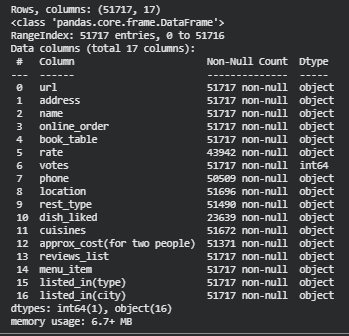

# Zomato Bangalore Restaurant Market Analysis

An exploratory data analysis of 51,660 restaurants across 93 areas of Bangalore, identifying what actually drives higher ratings — useful for restaurant owners, the Zomato platform, and investors.



## Business Problem

What factors — price, popularity, cuisine, location, table booking, online ordering — are actually associated with a restaurant getting better ratings on Zomato?

## Dataset

- **Size:** 51,660 restaurant listings
- **Coverage:** 93 areas across Bangalore
- **Source:** Zomato listings dataset

## Tools Used

`Python` `Pandas` `Matplotlib` `Seaborn` `Jupyter Notebook`

## Data Cleaning

The raw data required significant cleanup before analysis:
- Ratings were stored as strings like `"4.1/5"` — parsed into numeric values
- Price fields contained comma separators (e.g. `"1,200"`) — converted to numeric
- Inconsistent categorical labels and missing values were standardized

## Approach

Ran comparative analysis across multiple dimensions — price, popularity (vote count), cuisine type, location, and table-booking/online-ordering availability — against restaurant rating, using descriptive statistics and visualizations.

## Key Findings

- **Table booking correlates with higher ratings:** restaurants that allow table booking average **4.14** vs. **3.62** for those that don't
- **Popularity matters more than price:** number of votes tracks more closely with rating than price does — a cheaper, well-loved restaurant tends to outperform an expensive but less popular one (a moderate relationship, not a guarantee — other factors also affect ratings)

## Recommendations

- Restaurant owners should consider enabling table booking — it appears to boost perceived quality more than simply lowering prices
- Don't assume higher prices automatically mean better ratings — popularity is the stronger signal in this data
- Use locality- and cuisine-specific benchmarks to help new restaurant owners understand what "good" looks like in their category before opening or repricing
- Zomato could surface table-booking availability more prominently as a genuine quality signal for customers

## Repository Structure

```
zomato-bangalore-restaurant-analysis/
├── README.md
├── notebooks/
│   └── zomato_bangalore_eda.ipynb
├── reports/
│   └── zomato_analysis_report.docx
├── presentation/
│   └── zomato_analysis_presentation.pptx
├── data/
│   └── README.md   (data source/download link — raw data not committed)
├── requirements.txt
└── eda_priview.zip
```

## How to Run

```bash
git clone https://github.com/AkhilKataru/Restaurant_Rating_Drivers.git
cd Restaurant_Rating_Drivers
pip install -r requirements.txt
jupyter notebook Zomato_Bangalore_EDA.ipynb
```

## Data

Raw restaurant data is not included in this repository. See `data/README.md` for the source and download instructions.
